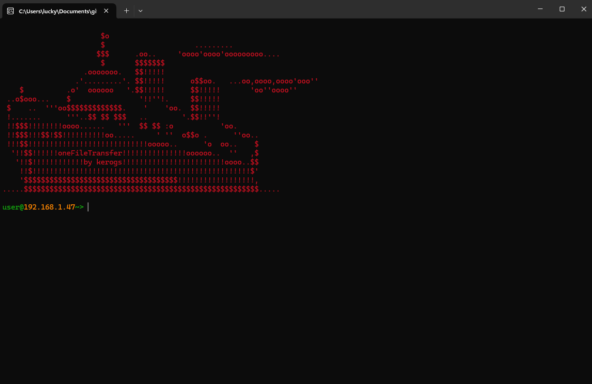

# oneFileTransfer
Easy local file transfer for windows.

## Installation
### Release
Install the lastest [release here](https://github.com/kerogs/oneFileTransfer/releases/latest) and

### Download code
To install the code, follow these steps
1. Go to the directory where the code is located
```sh
cd ./oneFileTransfer
```
2. Build code with Go
```go
go build ./main.go
```


## Command list
1. Use the following command first:
```sh
oft help
```

### List of command lines
```sh
user@192.168.1.47~> oft help
Usage: oft <command> [options]
Commands:
  host -d <directory> : Start hosting files from specified directory
  scan                 : Scan for hosts that are hosting files
  kill                 : Terminate the program (ctrl + c -> work too)
  clear                : Clear the console screen
```

## Preview
